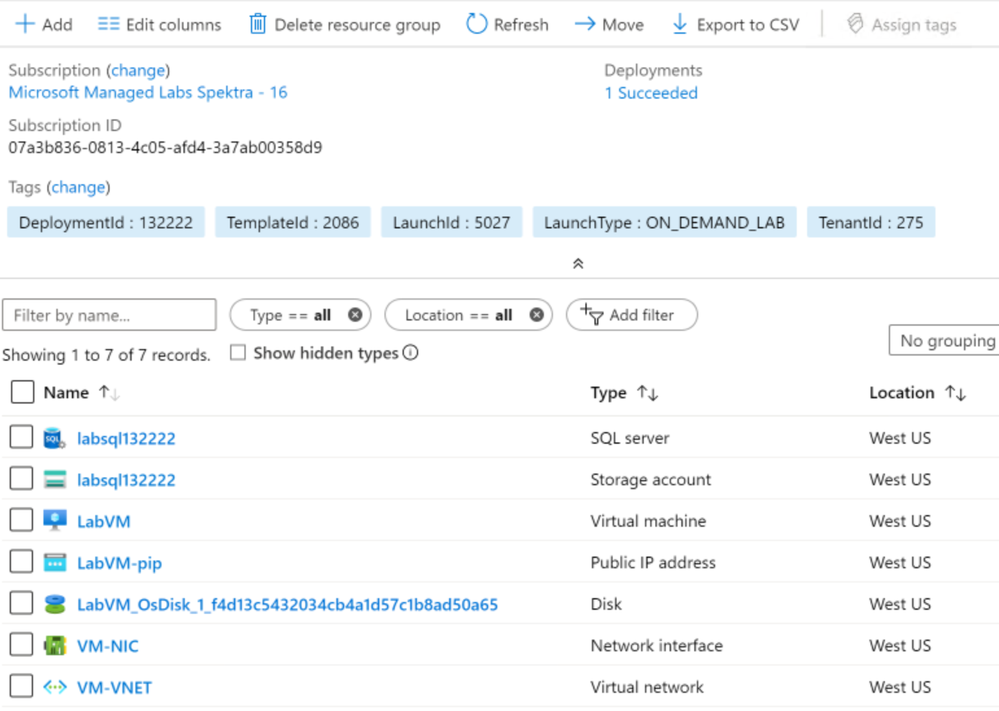
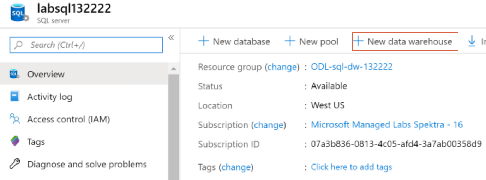
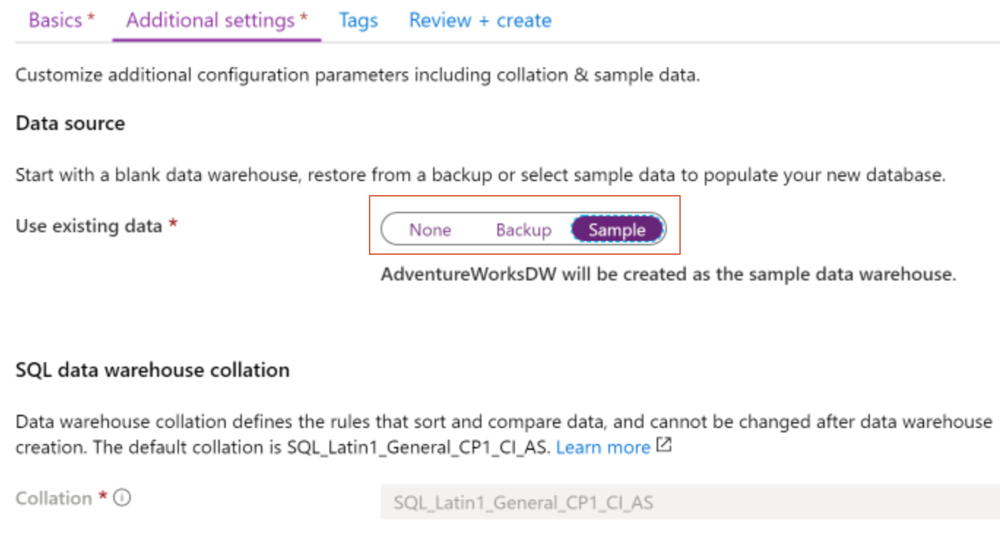

# Azure Synapse Lab Introduction

## Overview
In this workshop, you will work on a series of lab modules that teach you best practices for getting the most out of your Azure SQL Data Warehouse. These modules cover the entire lifecycle of data in your Azure SQL Data Warehouse from loading, to securing, querying, and optimizing the data. 

The dataset you’ll be working with is weather data from the National Oceanic and Atmospheric Organization (NOAA)

1.	Create your Azure lab environment
A link will be provided for you to create your Azure lab environment with all the necessary services. Please note that the environment is available for 10-12 hours since the time you sign up for it. Once the environment has been created, you will be presented with the login credentials to Azure portal and other relevant details. Record these details in a safe location.

  Sign-up link | **Please ask your instructor for the sign-up link**
  ------------ | -------------
  Activation Code | **Please ask your instructor**

2. After you have created the Azure lab environment, you will recieve a email with Azure Credentials, Environment Details, LabVM DNS Name, and additional information to access the environment.

3. Use the **LabVM DNS Name** to RDP or Azure Bastion to access the virtual machine in your Azure lab environment. 

4. Log into Portal from VM
   * Open a Chrome or Edge Dev browser in safety mode (InPrivate) and navigate to portal.azure.com and enter the Azure login credentials provided in the Environment Details
   * In the Azure portal under **Navigate** click the **Resource Groups** icon. Click on the only **Resource Group** that has been provisioned for the Azure lab environment. I should start with something like **ODL-sql-dw-NNNNN**
   * The provisioned Azure lab environment should look something like this:
  
  
  
   * Provisioning only created a Azure SQL server endpoint as shown in the image above. We need to create the Azure Synapse (data warehouse) for the next step of this lab. If your Azure lab environment has a Azure SQL data warehouse included please skip to step 5.
   
   * In the **ODL-sql-dw-NNNNN** resource group click the **labsqlNNNNNN** SQL Server service. From the **labsqlNNNNNN** SQL Server service **Overview** click the **New data warehouse** link to create a new Azure Synapse warehouse.
  
  
  
  * Enter the data warehouse name **AdventureWorksDW** and click the **Next: Additional settings >>** button. Under Additional Settings -> Data Sources -> **Use existing data** select the **sample** and click **Next: Tags** button.
  
  
  
  * Click Next: Review + create > button and the click then **Create** button to create the Azure Synapse (data warehouse).
  
  * After the Azure Synapse (data warehouse) is created, select your SQL Data Warehouse (AdventureWorksDW) service and go to overview. The Azure Synapse (data warehouse) should be running. If its paused, Click on **'Resume'** to start your SQL DW instance.
  
5. Configure SQL Server Firewall Settings
   * Click on the SQL Server name 
   * Click on 'Show Firewall Settings' 
   * Click on 'Add Client IP’ and click 'Save'
   * This will add your client IP address to the firewall so you can use client tools on your laptop to access your Azure SQL Server.
   

